# Kamiya 花卉商城功能流程图与时序图文档

本文档包含系统中各功能模块的流程图和时序图，使用 Mermaid 语法编写。

---

## 5.1 用户账户模块设计与实现

### 5.1.1 用户注册

#### 流程图

```mermaid
flowchart TD
    A[用户进入注册页面] --> B[填写注册信息<br/>用户名/手机号/密码]
    B --> C{前端验证格式}
    C -->|格式错误| D[显示错误提示]
    D --> B
    C -->|格式正确| E[发送注册请求<br/>POST /users]
    E --> F{检查用户名/手机号<br/>是否已存在}
    F -->|已存在| G[显示"用户名已存在"提示]
    G --> B
    F -->|不存在| H[创建新用户记录]
    H --> I[生成用户ID]
    I --> J[保存用户信息到数据库]
    J --> K[注册成功]
    K --> L[跳转到登录页面]
```

#### 时序图

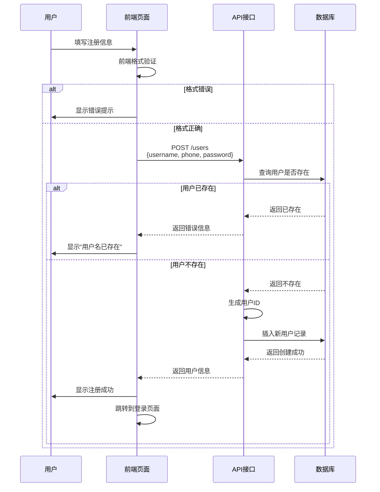

### 5.1.2 用户登录

#### 流程图

```mermaid
flowchart TD
    A[用户进入登录页面] --> B[输入登录标识<br/>ID/手机号/用户名 + 密码]
    B --> C{前端验证格式}
    C -->|格式错误| D[显示错误提示]
    D --> B
    C -->|格式正确| E[判断输入类型<br/>ID/手机号/用户名]
    E --> F[请求获取用户列表<br/>GET /users]
    F --> G[前端匹配用户信息]
    G --> H{用户是否存在}
    H -->|不存在| I[显示"用户不存在"提示]
    I --> B
    H -->|存在| J{密码是否正确}
    J -->|错误| K[显示"密码错误"提示]
    K --> B
    J -->|正确| L{用户角色}
    L -->|管理员| M[存储adminToken<br/>更新Pinia状态]
    L -->|普通用户| N[存储userToken<br/>更新Pinia状态]
    M --> O[跳转到管理后台]
    N --> P[跳转到首页]
```

#### 时序图

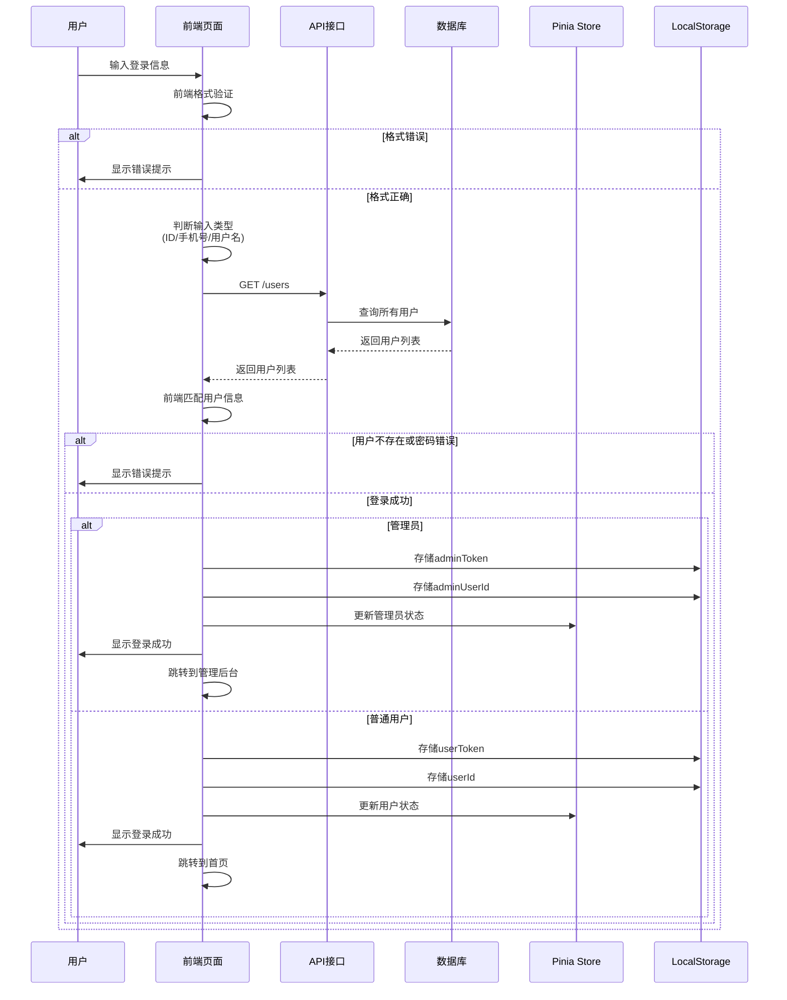

---

## 5.2 甜品展示与查询模块的设计与实现

### 5.2.1 甜品列表的查询

#### 流程图

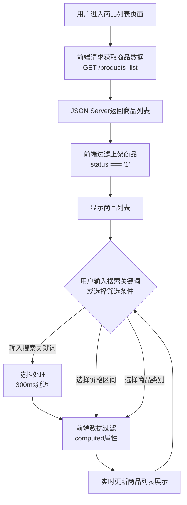

#### 时序图

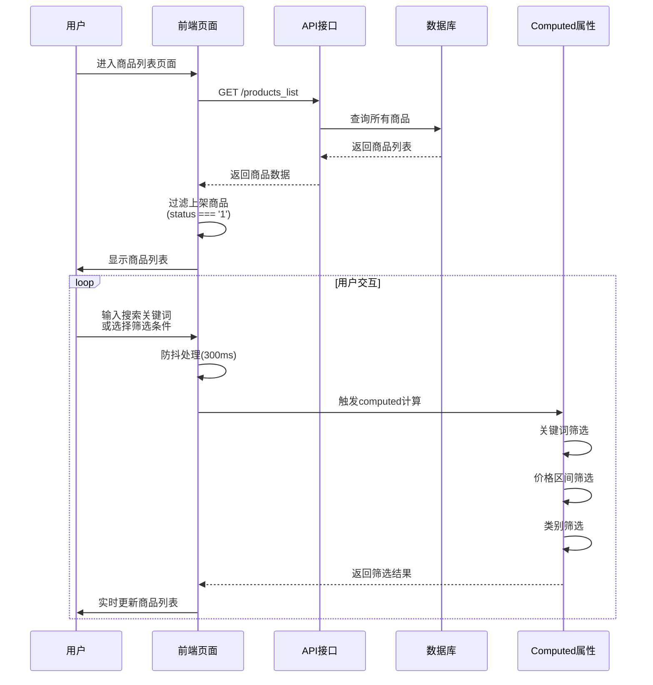

### 5.2.2 查看甜品详细

#### 流程图

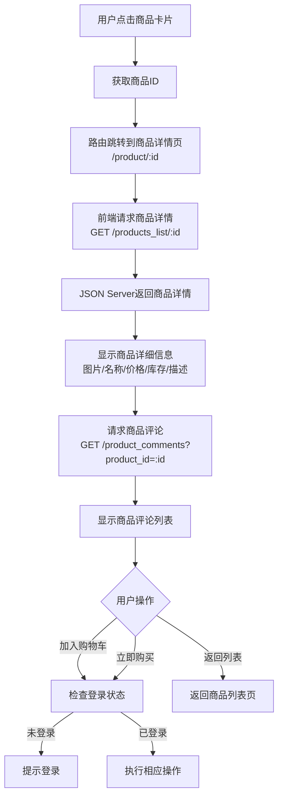

#### 时序图

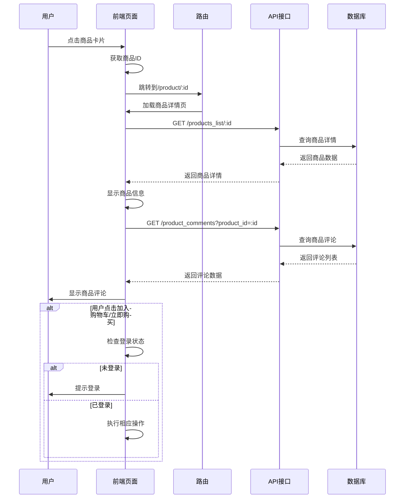

---

## 5.3 AI 创意定制模块的设计与实现

### 5.3.1 AI文生图生成

#### 流程图

```mermaid
flowchart TD
    A[用户进入AI定制页面] --> B[选择AI定制模式]
    B --> C[填写需求信息<br/>预算范围/预期时间/备注]
    C --> D[描述梦想中的甜品<br/>输入文本描述]
    D --> E[选择标签<br/>草莓/巧克力/双层等]
    E --> F[点击"生成设计灵感"按钮]
    F --> G{验证输入}
    G -->|描述为空| H[提示输入描述]
    H --> D
    G -->|验证通过| I[调用AI生成接口<br/>模拟生成图片]
    I --> J[生成3张设计方案图片]
    J --> K[显示设计方案预览]
    K --> L{用户操作}
    L -->|不满意| M[点击"再试一次"]
    M --> I
    L -->|满意| N[选择设计方案]
    N --> O[标记选中状态]
```

#### 时序图

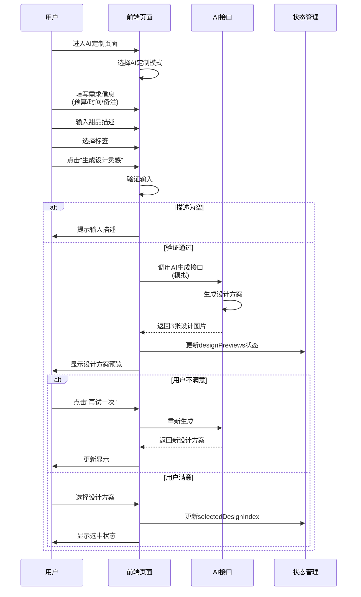

### 5.3.2 确认定制订单

#### 流程图

```mermaid
flowchart TD
    A[用户选择设计方案] --> B[点击"选择此图创建订单"]
    B --> C{验证是否已选择设计}
    C -->|未选择| D[提示选择设计方案]
    D --> A
    C -->|已选择| E[构建定制订单数据<br/>模式/描述/标签/预算/时间/备注/设计图]
    E --> F[存储到sessionStorage]
    F --> G[跳转到创建订单页面<br/>/create-order]
    G --> H[从sessionStorage读取定制数据]
    H --> I[显示定制信息]
    I --> J[用户填写取餐信息<br/>姓名/电话]
    J --> K[创建订单<br/>POST /normal_orders]
    K --> L[订单创建成功]
    L --> M[跳转到订单列表]
```

#### 时序图

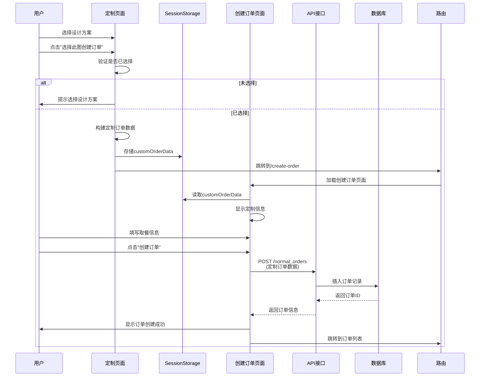

---

## 5.4 购物车与交易结算模块的设计与实现

### 5.4.1 购物车管理

#### 流程图

```mermaid
flowchart TD
    A[用户点击"加入购物车"] --> B{检查登录状态}
    B -->|未登录| C[提示登录]
    C --> D[跳转到登录页]
    B -->|已登录| E[获取商品详情<br/>GET /products_list/:id]
    E --> F{检查商品状态}
    F -->|商品不存在| G[显示"商品不存在"提示]
    F -->|商品已下架| H[显示"商品已下架"提示]
    F -->|库存不足| I[显示"库存不足"提示]
    F -->|商品正常| J{检查购物车中<br/>是否已存在该商品}
    J -->|已存在| K[更新商品数量<br/>PUT /cart/:id]
    J -->|不存在| L[添加新商品<br/>POST /cart]
    K --> M[检查库存是否充足]
    L --> M
    M -->|库存不足| N[显示库存不足提示]
    M -->|库存充足| O[更新Pinia Store]
    O --> P[更新localStorage]
    P --> Q[显示"已添加到购物车"提示]
```

#### 时序图

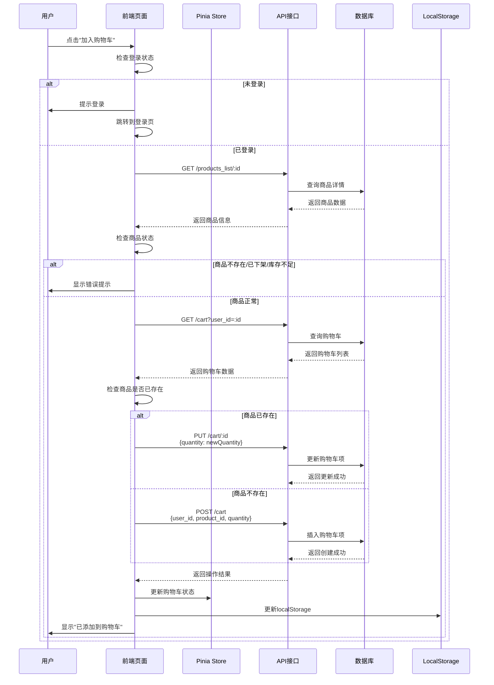

### 5.4.2 订单生成与结算

#### 流程图

```mermaid
flowchart TD
    A[用户点击"去结算"] --> B[获取购物车商品列表]
    B --> C[遍历商品，检查库存<br/>GET /products_list/:id]
    C --> D{所有商品<br/>库存充足?}
    D -->|否| E[显示库存不足提示<br/>提示具体商品]
    E --> A
    D -->|是| F[构建订单数据<br/>包含商品快照]
    F --> G[创建订单<br/>POST /normal_orders]
    G --> H{订单创建成功?}
    H -->|否| I[显示创建失败提示]
    H -->|是| J[遍历订单商品]
    J --> K[扣除库存<br/>PUT /products_list/:id]
    K --> L[清空购物车<br/>DELETE /cart]
    L --> M[更新Pinia Store]
    M --> N[更新localStorage]
    N --> O[显示"订单创建成功"提示]
    O --> P[跳转到订单列表页面]
```

#### 时序图

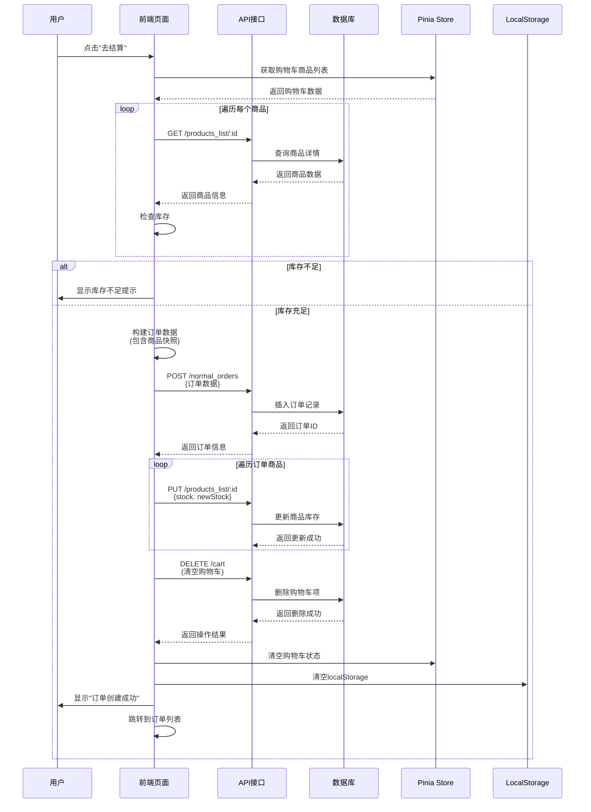

---

## 5.5 用户订单管理模块的设计与实现

### 5.5.1 查看我的订单

#### 流程图

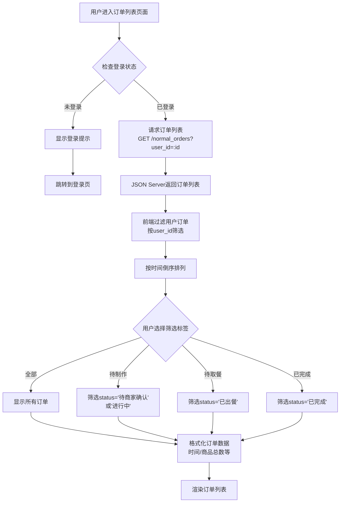

#### 时序图

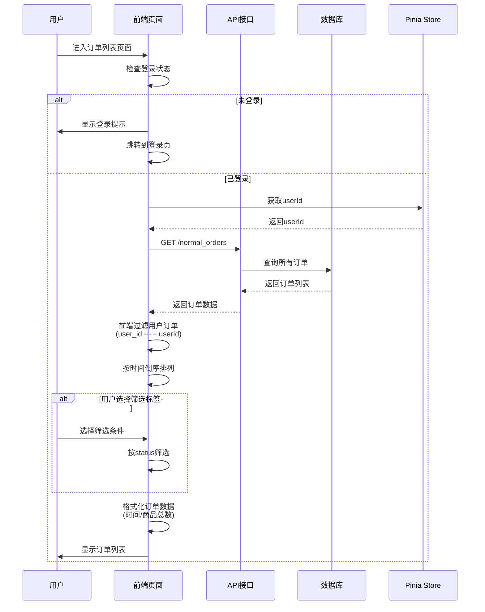

### 5.5.2 订单状态变更

#### 流程图

```mermaid
flowchart TD
    A[用户查看订单列表] --> B{订单状态}
    B -->|待商家确认| C[显示"取消订单"按钮]
    B -->|已出餐| D[显示"确认取餐"按钮]
    B -->|已完成| E[显示"去评论"按钮]
    C --> F[用户点击"取消订单"]
    D --> G[用户点击"确认取餐"]
    F --> H[弹出二次确认框]
    G --> H
    H --> I{用户确认?}
    I -->|取消| J[关闭确认框]
    I -->|确认| K[发送更新请求<br/>PATCH /normal_orders/:id]
    K --> L{操作类型}
    L -->|取消订单| M[更新status='已取消']
    L -->|确认取餐| N[更新status='已完成'<br/>completed_time=当前时间]
    M --> O[更新成功]
    N --> O
    O --> P[刷新订单列表]
    P --> Q[显示操作成功提示]
```

#### 时序图

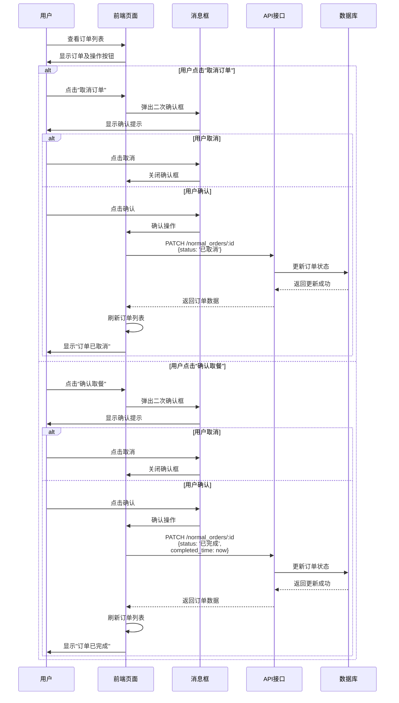

---

## 5.6 甜品评价模块的设计与实现

### 流程图

```mermaid
flowchart TD
    A[用户查看已完成订单] --> B[点击"去评论"按钮]
    B --> C[跳转到评价页面<br/>/order-review/:orderId]
    C --> D[获取订单详情<br/>GET /normal_orders/:id]
    D --> E[显示订单商品列表]
    E --> F[用户填写评价信息<br/>评分/内容/标签/图片]
    F --> G[点击"提交评价"按钮]
    G --> H{验证评价信息}
    H -->|评分为空| I[提示选择评分]
    I --> F
    H -->|验证通过| J[遍历订单商品]
    J --> K[生成评论ID<br/>C001, C002...]
    K --> L[构建评论数据]
    L --> M[提交评论<br/>POST /product_comments]
    M --> N{所有商品<br/>评价完成?}
    N -->|否| J
    N -->|是| O[显示"评价提交成功"提示]
    O --> P[跳转到订单列表页面]
```

### 时序图

```mermaid
sequenceDiagram
    participant U as 用户
    participant F as 前端页面
    participant R as 路由
    participant A as API接口
    participant D as 数据库
    participant G as ID生成器

    U->>F: 查看已完成订单
    U->>F: 点击"去评论"
    F->>R: 跳转到/order-review/:orderId
    R->>F: 加载评价页面
    F->>A: GET /normal_orders/:id
    A->>D: 查询订单详情
    D-->>A: 返回订单数据
    A-->>F: 返回订单信息
    F->>U: 显示订单商品列表
    
    U->>F: 填写评价信息<br/>(评分/内容/标签/图片)
    U->>F: 点击"提交评价"
    F->>F: 验证评价信息
    alt 评分为空
        F->>U: 提示选择评分
    else 验证通过
        loop 遍历订单商品
            F->>G: 生成评论ID
            G-->>F: 返回评论ID(C001/C002...)
            F->>F: 构建评论数据
            F->>A: POST /product_comments<br/>{评论数据}
            A->>D: 插入评论记录
            D-->>A: 返回创建成功
            A-->>F: 返回评论信息
        end
        F->>U: 显示"评价提交成功"
        F->>R: 跳转到订单列表
    end
```

---

## 5.7 用户个人信息模块的设计与实现

### 流程图

```mermaid
flowchart TD
    A[用户进入个人中心] --> B[获取用户信息<br/>GET /users/:id]
    B --> C[显示用户信息<br/>头像/昵称/订单统计]
    C --> D{用户操作}
    D -->|修改头像| E[点击头像编辑按钮]
    D -->|修改昵称| F[点击昵称编辑按钮]
    E --> G{选择上传方式}
    G -->|上传本地图片| H[选择图片文件]
    G -->|输入图片URL| I[输入图片URL]
    H --> J[上传图片<br/>POST /upload/avatar]
    I --> K[使用输入的URL]
    J --> L[获取图片路径]
    K --> L
    L --> M[更新用户信息<br/>PATCH /users/:id]
    M --> N[更新localStorage]
    N --> O[更新Pinia Store]
    O --> P[刷新显示]
    F --> Q[输入新昵称]
    Q --> R[验证昵称格式]
    R -->|格式错误| S[显示错误提示]
    S --> Q
    R -->|格式正确| M
```

### 时序图

```mermaid
sequenceDiagram
    participant U as 用户
    participant F as 前端页面
    participant A as API接口
    participant D as 数据库
    participant S as Pinia Store
    participant L as LocalStorage

    U->>F: 进入个人中心
    F->>A: GET /users/:id
    A->>D: 查询用户信息
    D-->>A: 返回用户数据
    A-->>F: 返回用户信息
    F->>U: 显示用户信息
    
    alt 用户修改头像
        U->>F: 点击头像编辑按钮
        F->>U: 显示编辑对话框
        U->>F: 选择上传方式
        alt 上传本地图片
            U->>F: 选择图片文件
            F->>A: POST /upload/avatar<br/>{file}
            A->>A: 处理图片上传
            A-->>F: 返回图片URL
        else 输入图片URL
            U->>F: 输入图片URL
            F->>F: 使用输入的URL
        end
        F->>A: PATCH /users/:id<br/>{user_info: {avatar: url}}
        A->>D: 更新用户信息
        D-->>A: 返回更新成功
        A-->>F: 返回用户数据
        F->>L: 更新localStorage
        F->>S: 更新Pinia Store
        F->>U: 显示"头像更新成功"
        F->>F: 刷新显示
    else 用户修改昵称
        U->>F: 点击昵称编辑按钮
        F->>U: 显示编辑输入框
        U->>F: 输入新昵称
        F->>F: 验证昵称格式
        alt 格式错误
            F->>U: 显示错误提示
        else 格式正确
            F->>A: PATCH /users/:id<br/>{user_info: {nickname: newName}}
            A->>D: 更新用户信息
            D-->>A: 返回更新成功
            A-->>F: 返回用户数据
            F->>L: 更新localStorage
            F->>S: 更新Pinia Store
            F->>U: 显示"昵称更新成功"
            F->>F: 刷新显示
        end
    end
```

---

## 附录：Mermaid 图表说明

### 流程图符号说明

- **矩形**: 表示处理步骤
- **菱形**: 表示判断/决策点
- **圆角矩形**: 表示开始/结束
- **箭头**: 表示流程方向

### 时序图符号说明

- **参与者**: 系统各组件（用户、前端、API、数据库等）
- **生命线**: 垂直虚线表示参与者的生命周期
- **消息**: 箭头表示消息传递方向
- **激活框**: 矩形框表示参与者处于激活状态
- **alt/else**: 表示条件分支
- **loop**: 表示循环

---

**文档版本**: v1.0  
**最后更新**: 2025-12-28  
**维护人员**: 开发团队

